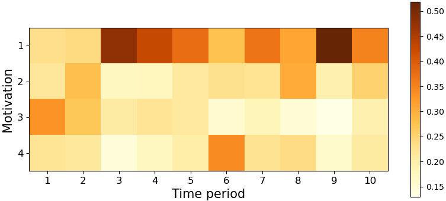
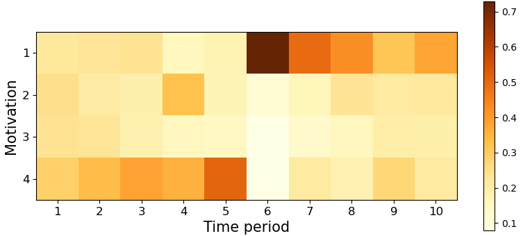
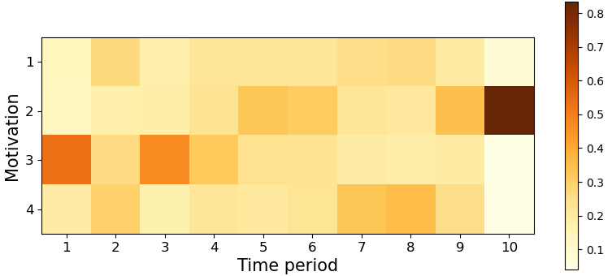
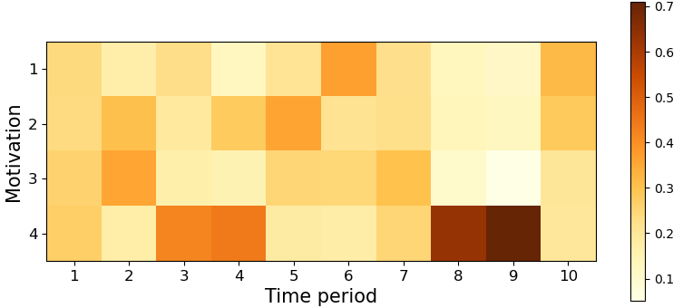

[](https://pubsonline.informs.org/journal/ijoc)

# An Interpretable Preference Learning Model Admitting Dynamic and Context-Dependent Preferences

This archive is distributed in association with the [INFORMS Journal on
Computing](https://pubsonline.informs.org/journal/ijoc) under the [MIT License](LICENSE.txt).

The software and data in this repository are a snapshot of the software and data
that were used in the research reported on in the paper 
[An Interpretable Preference Learning Model Admitting Dynamic and Context-Dependent Preferences](https://doi.org/10.1287/ijoc.2023.0372) by Zice Ru, Jiapeng Liu, Miłosz Kadziński, Xiuwu Liao, and Xinlong Li.

## Cite

Paper DOI: https://doi.org/10.1287/ijoc.2023.0372

Code DOI: https://doi.org/10.1287/ijoc.2023.0372.cd

Below is the BibTex for citing this snapshot of the repository.

```
@misc{Ru2026,
  author =        {Zice Ru, Jiapeng Liu, Miłosz Kadziński, Xiuwu Liao, and Xinlong Li},
  publisher =     {INFORMS Journal on Computing},
  title =         {An Interpretable Preference Learning Model Admitting Dynamic and Context-Dependent Preferences},
  year =          {2026},
  doi =           {10.1287/ijoc.2023.0372.cd},
  url =           {https://github.com/INFORMSJoC/2023.0372},
  note =          {Available for download at https://github.com/INFORMSJoC/2023.0372},
}  
```

## Description

The purpose of this software is to implement and evaluate an interpretable preference learning model designed to handle dynamic and context-dependent preferences.

## Building

**Main dependencies:**

* Python>=3.8
* NumPy
* torch>=1.9.0 
* matplotlib>=3.5.0
* wordcloud>=1.8.1
* pandas>=1.3.0
* bokeh>=2.4.0

## Results

Figures 3 and 4 in the paper depict the word clouds for the five positive and three negative topics, respectively. In these visualizations, each element represents a pair of feature and opinion words from an FOP triplet. The font size of each word pair illustrates its probability of occurrence within that specific topic.

<div style="display: flex; justify-content: center; gap: 10px;">
  
  
  
</div>
<div style="display: flex; justify-content: center; gap: 10px;">
  
  
</div>
<br>
<div style="display: flex; justify-content: center; gap: 10px;">
  
  
  
</div>

Figure 5 in the paper displays heat maps of these weights for four randomly selected users. Each subplot illustrates motivations (rows) across different time periods (columns), where the color intensity reflects the posterior probability of each motivation. This visualization highlights substantial temporal variation in motivation weights, revealing distinct patterns among users.

<div style="display: flex; justify-content: center; gap: 10px;">
  
  
</div>
<div style="display: flex; justify-content: center; gap: 10px;">
  
  
</div>

## Replicating

* To reproduce the results reported for the Amazon dataset, please run the scripts in the **`src`** folder whose filenames begin with **`cell_p`**.
* To reproduce the results reported for the Google Map dataset, please run the scripts in the **`src`** folder whose filenames begin with **`google_map`**.
* To reproduce the results reported for the MovieLens dataset, please run the scripts in the **`src`** folder whose filenames begin with **`movie`**.
* To replicate the reported results for the model performance comparison—specifically for rating prediction, item representation, and user representation—please run the scripts in the **`src`** folder whose filenames begin with **`evaluation`**.

## Directory Structure

* **`data/`**: Provides the Amazon, Google Maps, and MovieLens datasets analyzed in this study. For each dataset, the folder contains both the FOP triplets derived from user reviews and the corresponding user rating data for items.

* **`docs/`**: Provides the supplementary material of this paper, including methods for posterior inference and prediction based on the expected comprehensive value of each item, experimental results on the Google Maps and MovieLens datasets, descriptions of benchmark models for predictive evaluation, and robustness analyses on datasets with varying characteristics.

* **`intermediate/`**: Provides intermediate variables and temporary model files saved during runtime. These are used to persist data between different stages of the pipeline.

* **`results/`**: Provides all figures and images presented in the paper, including visualizations of experimental results and model outputs.

* **`src/`**: Provides the source code for all experiments and analyses reported in the paper, including model implementation, data processing, and evaluation scripts.